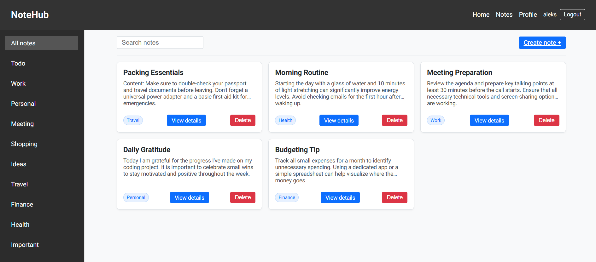
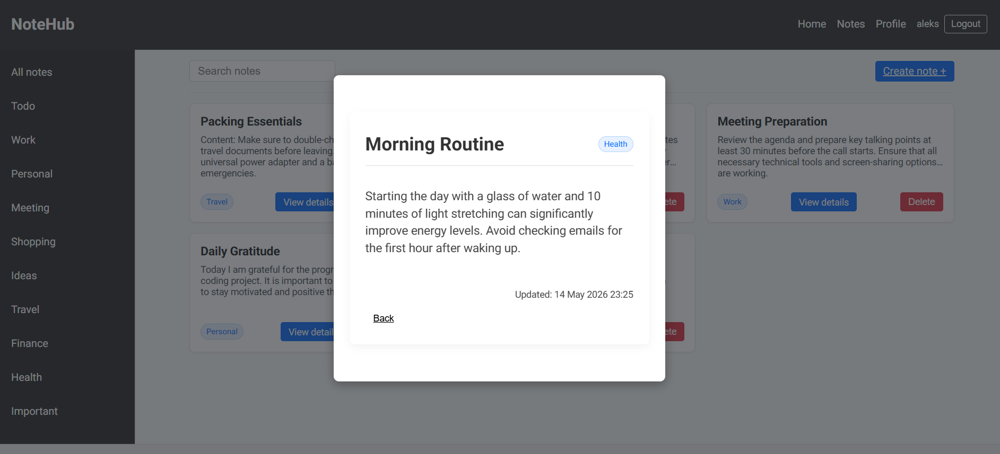
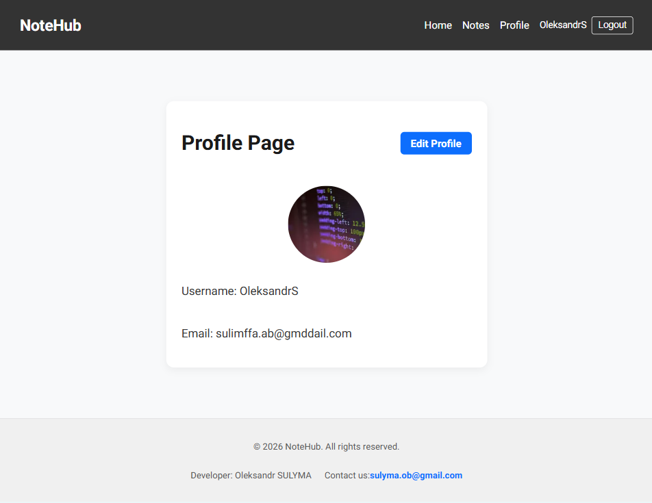

# NoteHub Frontend

Frontend application for NoteHub, a fullstack notes management app with authentication, protected routes, profile management, avatar upload, note creation, search, filtering, pagination, and persistent note drafts.

The app is built with Next.js App Router, React, TypeScript, TanStack Query, Zustand, React Hook Form, Zod, and CSS Modules. It communicates with the NoteHub backend through Next.js API routes that proxy requests and preserve HTTP-only authentication cookies.

## Live Demo

- Frontend: [https://note-hub-iota.vercel.app](https://note-hub-iota.vercel.app)
- Backend API: [https://nodejs-hw-awfs.onrender.com](https://nodejs-hw-awfs.onrender.com)
- Backend repository: [NoteHub Backend](https://github.com/Oleksandr-Sulyma/nodejs-hw)

## Preview





## Features

- User registration and login
- Protected routes for notes and profile pages
- HTTP-only cookie authentication handled through Next.js API routes
- Session check and automatic refresh flow
- Notes list with pagination
- Search notes by keyword
- Filter notes by tag
- Create, view, edit, and delete notes
- Note details page and intercepted modal preview
- Persistent note draft stored with Zustand
- User profile page
- Username update
- Avatar upload
- Form validation with React Hook Form and Zod
- Server-side and client-side data fetching
- Toast notifications for user feedback
- Responsive UI styled with CSS Modules

## Tech Stack

- Next.js
- React
- TypeScript
- TanStack Query
- Zustand
- React Hook Form
- Zod
- Axios
- React Hot Toast
- React Paginate
- CSS Modules
- Vercel

## Project Structure

```text
app/
  (auth routes)/
  (private routes)/
  @modal/
  api/
  layout.tsx
  page.tsx
components/
hooks/
lib/
  api/
  constants/
  store/
public/
types/
proxy.ts
next.config.ts
```

## Getting Started

### 1. Clone the repository

```bash
git clone https://github.com/Oleksandr-Sulyma/NoteHub.git
cd NoteHub
```

### 2. Install dependencies

```bash
npm install
```

### 3. Configure environment variables

Create a `.env.local` file in the project root and use `.env.example` as a reference.

```env
NEXT_PUBLIC_API_URL=http://localhost:3000
BACKEND_API_URL=http://localhost:9999
```

For production, set these variables to the deployed frontend and backend URLs.

```env
NEXT_PUBLIC_API_URL=https://your-frontend-domain.com
BACKEND_API_URL=https://your-backend-api.com
```

### 4. Run the development server

```bash
npm run dev
```

Open [http://localhost:3000](http://localhost:3000) in the browser.

## Available Scripts

| Script | Description |
| --- | --- |
| `npm run dev` | Start the Next.js development server |
| `npm run build` | Build the application for production |
| `npm start` | Start the production server |
| `npm run lint` | Run ESLint |
| `npm run format` | Format project files with Prettier |

## Environment Variables

| Variable | Description |
| --- | --- |
| `NEXT_PUBLIC_API_URL` | Base URL used by the browser to call this Next.js app API routes |
| `BACKEND_API_URL` | Backend API URL used by Next.js route handlers on the server side |

## Application Routes

| Route | Description | Access |
| --- | --- | --- |
| `/` | Home page | Public |
| `/sign-in` | Login page | Public only |
| `/sign-up` | Registration page | Public only |
| `/notes/filter/[...slug]` | Notes list with tag filtering, search, and pagination | Private |
| `/notes/action/create` | Create note page | Private |
| `/notes/[id]` | Note details page | Private |
| `/profile` | Current user profile | Private |
| `/profile/edit` | Edit username and avatar | Private |

## API Proxy Routes

The frontend exposes Next.js API routes under `/api`. These routes forward requests to the backend and keep authentication cookies on the server side.

| Method | Route | Backend target |
| --- | --- | --- |
| `POST` | `/api/auth/register` | `/auth/register` |
| `POST` | `/api/auth/login` | `/auth/login` |
| `POST` | `/api/auth/logout` | `/auth/logout` |
| `GET` | `/api/auth/session` | `/auth/session` |
| `GET` | `/api/notes` | `/notes` |
| `POST` | `/api/notes` | `/notes` |
| `GET` | `/api/notes/[id]` | `/notes/:id` |
| `PATCH` | `/api/notes/[id]` | `/notes/:id` |
| `DELETE` | `/api/notes/[id]` | `/notes/:id` |
| `GET` | `/api/users/me` | `/users/me` |
| `PATCH` | `/api/users/me` | `/users/me/username` and `/users/me/avatar` |

## Notes Functionality

The notes list supports:

- Pagination with 12 notes per page
- Search by title or content
- Filtering by tag
- Protected access per authenticated user

Available note tags:

```text
Todo, Work, Personal, Meeting, Shopping, Ideas, Travel, Finance, Health, Important
```

Note validation:

- `title`: 3 to 50 characters
- `content`: up to 500 characters
- `tag`: one of the available tags

## Authentication Flow

1. The user registers or logs in through the frontend.
2. The request goes to a Next.js API route.
3. The API route forwards credentials to the backend.
4. Backend returns HTTP-only cookies.
5. Next.js stores and forwards cookies for protected requests.
6. `proxy.ts` protects private routes and redirects unauthenticated users to `/sign-in`.

## Architecture Notes

- Next.js App Router is used for routing, layouts, route handlers, and intercepted modal routes.
- TanStack Query handles server state, caching, invalidation, and async UI updates.
- Zustand persists unfinished note drafts in local storage.
- React Hook Form and Zod provide form state management and schema validation.
- Axios instances separate browser-facing Next.js API calls from backend-facing server calls.
- `next.config.ts` allows optimized remote images from Cloudinary and configured asset hosts.

## Related Repository

This frontend works together with the NoteHub backend:

- [NoteHub Backend](https://github.com/Oleksandr-Sulyma/nodejs-hw)

## Author

Oleksandr Sulyma

- GitHub: [Oleksandr-Sulyma](https://github.com/Oleksandr-Sulyma)
- LinkedIn: [oleksandr-sulyma](https://www.linkedin.com/in/oleksandr-sulyma/)
